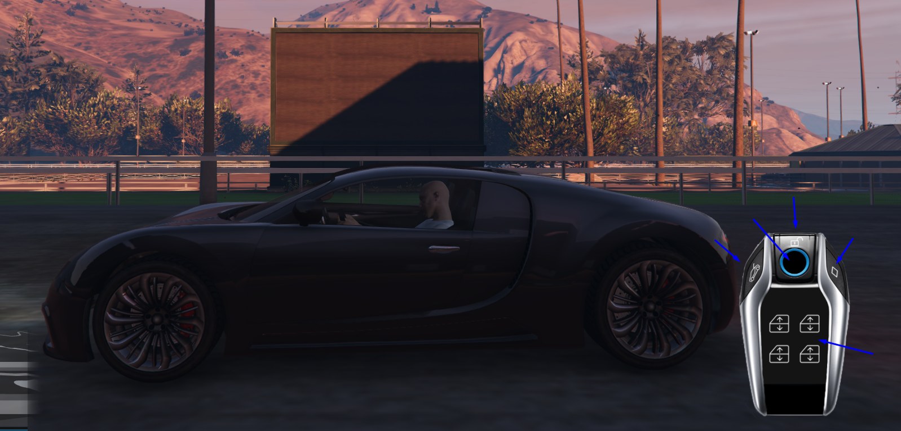

<h1><b>This fork adds the ability to lock/unlock doors of vehicles you own. It requires mysql-async or oxmysql to be installed, therefore it uses SQL to check ownership of vehicles.</b></h1>

<h3><a href="https://discord.gg/RsWzxwtAY3">Discord</a></h3>

# rr_keyfob

A simple keyfob script to control your car
You can open your trunk/frunk, lock/unlock your car, start/stop your car, trigger your alarm and control your windows.
Also have a look at the config, there are a few things you can toggle.

I hope you will enjoy this simple resource ;)

## Warning

When installing the resource make sure you rename it to `rr_keyfob`

## Usage

To open the keyfob press `I` this can be changed by the user in their keybindings
When the button is pressed the keyfob will appear and nui focus will be on.
There are a few buttons the player can click (see image below)

As you can see you have four buttons + the screen. The screen will be updated at a later time to have multiple pages and even more control.
For now you have the following buttons:

- Left Side -> Open trunk (or if the engine is in the rear open frunk)
- Right Side -> Toggle Engine
- Unlock Icon -> Unlock the car | Double press to trigger the alarm
- Circle -> Lock the car
- Screen -> Each window button opens a specific window (top left opens fron left window, etc etc)

## Roadmap

If there is interest in this resource I will probably rewrite a bit of the code to make it cleaner.
And I will also add multiple pages to the screen. The pages I was thinking of creating

- Fuel page (See amount of fuel left)
- Door Control page (Control the vehicle doors)
- More to come....

The icons used:
[Car window icons created by LAFS - Flaticon](https://www.flaticon.com/free-icons/car-window)

If you have any further questions please join my <a href="https://discord.gg/RsWzxwtAY3">Discord</a>. So that I can help you

## Legal

# License

rr_keyfob
Copyright (c) 2022 RoleplayRevisited

Permission is hereby granted, free of charge, to any person obtaining a copy
of this software and associated documentation files (the "Software"), to deal
in the Software without restriction, including without limitation the rights
to use, copy, modify, merge, publish, distribute, sublicense, and/or sell
copies of the Software, and to permit persons to whom the Software is
furnished to do so, subject to the following conditions:

The above copyright notice and this permission notice shall be included in all
copies or substantial portions of the Software.

THE SOFTWARE IS PROVIDED "AS IS", WITHOUT WARRANTY OF ANY KIND, EXPRESS OR
IMPLIED, INCLUDING BUT NOT LIMITED TO THE WARRANTIES OF MERCHANTABILITY,
FITNESS FOR A PARTICULAR PURPOSE AND NONINFRINGEMENT. IN NO EVENT SHALL THE
AUTHORS OR COPYRIGHT HOLDERS BE LIABLE FOR ANY CLAIM, DAMAGES OR OTHER
LIABILITY, WHETHER IN AN ACTION OF CONTRACT, TORT OR OTHERWISE, ARISING FROM,
OUT OF OR IN CONNECTION WITH THE SOFTWARE OR THE USE OR OTHER DEALINGS IN THE
SOFTWARE.
